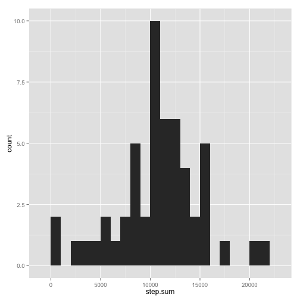
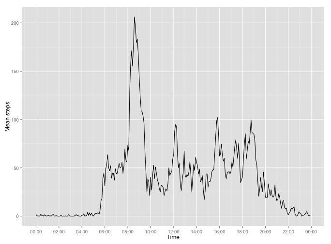
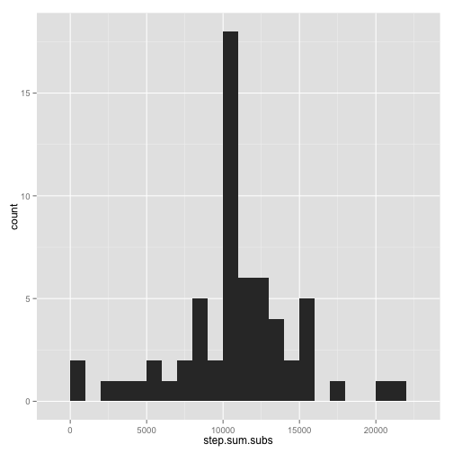
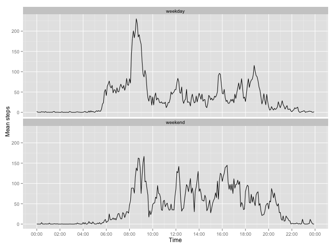

Reproducible research- Peer assessment project 1
========================================================

This assignment makes use of data from a personal activity monitoring device. This device collects data at 5 minute intervals through out the day. The data consists of two months of data from an anonymous individual collected during the months of October and November, 2012 and include the number of steps taken in 5 minute intervals each day.

The dataset contains three variables:

1. The number of steps taken by the person in a 5-minute interval
2. The date
3. The starting time of the 5-minute interval


## Loading and preprocessing the data

Let's first load in the dataset, and then get a summary of the raw datafile as well as looking at the structure of the dataframe in R:


```r
library(ggplot2)
library(scales)
```


```r
unzip('./activity.zip')
activity.data <- read.table(file='./activity.csv', sep = ',', header=TRUE)
summary(activity.data)
```

```
##      steps               date          interval   
##  Min.   :  0.0   2012-10-01:  288   Min.   :   0  
##  1st Qu.:  0.0   2012-10-02:  288   1st Qu.: 589  
##  Median :  0.0   2012-10-03:  288   Median :1178  
##  Mean   : 37.4   2012-10-04:  288   Mean   :1178  
##  3rd Qu.: 12.0   2012-10-05:  288   3rd Qu.:1766  
##  Max.   :806.0   2012-10-06:  288   Max.   :2355  
##  NA's   :2304    (Other)   :15840
```

```r
str(activity.data)
```

```
## 'data.frame':	17568 obs. of  3 variables:
##  $ steps   : int  NA NA NA NA NA NA NA NA NA NA ...
##  $ date    : Factor w/ 61 levels "2012-10-01","2012-10-02",..: 1 1 1 1 1 1 1 1 1 1 ...
##  $ interval: int  0 5 10 15 20 25 30 35 40 45 ...
```


We can see that there are quite a lot `NA` values in the `steps` variable ( which will be adressed in later parts of the analysis).
R has read in the dates as a factor, so it would be preferable to convert the class of this variable into `POSIXlt` using `strptime()`.
Also, R has interpreted `interval` as integers while it should rather be a time.
Because we also want to investigate the effect of the weekdays vs. weekends, I will also use the weekday to create a binary variable (`"weekday"`) indicating whether it is a weekday (`"weekday"`) or weekend (`"weekend"`).


```r
# Pad time with leading zeros and converting date/time to POSIXlt, while adding to activity.data

padded.time <- sprintf("%04d", activity.data$interval)
padded.datetime <- paste(activity.data$date, padded.time)
activity.data$times <- strptime(padded.time, "%H%M")
activity.data$dates <- strptime(padded.datetime, "%Y-%m-%d %H%M")

# Creating weekday binary factor
weekends <- as.factor((weekdays(activity.data$dates) == 'Saturday' | weekdays(activity.data$dates) == 'Sunday'))
levels(weekends) <- c('weekday', 'weekend')
activity.data$weekday <- weekends
```
And now `activity.data` looks like this:


```r
summary(activity.data)
```

```
##      steps               date          interval   
##  Min.   :  0.0   2012-10-01:  288   Min.   :   0  
##  1st Qu.:  0.0   2012-10-02:  288   1st Qu.: 589  
##  Median :  0.0   2012-10-03:  288   Median :1178  
##  Mean   : 37.4   2012-10-04:  288   Mean   :1178  
##  3rd Qu.: 12.0   2012-10-05:  288   3rd Qu.:1766  
##  Max.   :806.0   2012-10-06:  288   Max.   :2355  
##  NA's   :2304    (Other)   :15840                 
##      times                         dates                    
##  Min.   :2014-08-15 00:00:00   Min.   :2012-10-01 00:00:00  
##  1st Qu.:2014-08-15 05:58:45   1st Qu.:2012-10-16 05:58:45  
##  Median :2014-08-15 11:57:30   Median :2012-10-31 11:57:30  
##  Mean   :2014-08-15 11:57:30   Mean   :2012-10-31 11:30:49  
##  3rd Qu.:2014-08-15 17:56:15   3rd Qu.:2012-11-15 17:56:15  
##  Max.   :2014-08-15 23:55:00   Max.   :2012-11-30 23:55:00  
##                                                             
##     weekday     
##  weekday:12960  
##  weekend: 4608  
##                 
##                 
##                 
##                 
## 
```

```r
str(activity.data)
```

```
## 'data.frame':	17568 obs. of  6 variables:
##  $ steps   : int  NA NA NA NA NA NA NA NA NA NA ...
##  $ date    : Factor w/ 61 levels "2012-10-01","2012-10-02",..: 1 1 1 1 1 1 1 1 1 1 ...
##  $ interval: int  0 5 10 15 20 25 30 35 40 45 ...
##  $ times   : POSIXlt, format: "2014-08-15 00:00:00" "2014-08-15 00:05:00" ...
##  $ dates   : POSIXlt, format: "2012-10-01 00:00:00" "2012-10-01 00:05:00" ...
##  $ weekday : Factor w/ 2 levels "weekday","weekend": 1 1 1 1 1 1 1 1 1 1 ...
```

I will then create a subset of the dataframe where all `NA` values are removed, which will be used for the first parts of the analysis. I also drop unused factor levels, i.e. the days where all `step` measurements are `NA`.


```r
ad.no.na <- droplevels(activity.data[!is.na(activity.data$steps), ])
```

## What is mean total number of steps taken per day?
First I will calculate the total number of steps per day and display the results in a histogram.


```r
step.sum <- tapply(ad.no.na$steps, as.factor(ad.no.na$date), sum)
qplot(step.sum, binwidth=1000) 
```

 

Then we want to get the mean and median of the total number of steps per day:


```r
mean(step.sum)
```

```
## [1] 10766
```

```r
median(step.sum)
```

```
## [1] 10765
```
We can see that the mean is 10766 steps/day, and the median is 10765 steps/day. These two numbers are very close.


## What is the average daily activity pattern?

We now want to look at how the average activity levels vary over the course of the day, so we calculate the mean number of steps for each interval and plot the results:


```r
step.mean <- tapply(ad.no.na$steps, as.factor(ad.no.na$interval), mean)
qplot(x=unique(ad.no.na$times), y=step.mean, geom='line') + 
    scale_x_datetime(breaks = date_breaks("2 hour"), labels=date_format("%H:%M")) +
    xlab("Time") +
    ylab("Mean steps")
```

 

Then we want to find the interval with the average maximum number of steps during the day:


```r
format(unique(ad.no.na$times)[which(step.mean == max(step.mean))], "%H:%M")
```

```
## [1] "08:35"
```

```r
max(step.mean)
```

```
## [1] 206.2
```

We find that the 5 minute interval from 08:35 to 08:40 is the interval with the highest mean number of steps (206).


## Imputing missing values
Now we want to use the entire dataset and substitute the `NA`s with appropriate values.
First we want to estimate the total number of `NA`s .


```r
sum(is.na(activity.data))
```

```
## [1] 2304
```

The total number of `NA`s in the original dataset is 2304 (like we saw previously using `summary()`).

We want to substitute the `NA`s with appropriate values based on the rest of the dataset.
One can choose the mean/median of the day or of the time interval as a substitute value.
I will choose to use the mean of the 5 minute interval on the other days in the dataset as a substitute.


```r
ad.subs <- activity.data
interval.index <- unique(activity.data$interval)
for (i in which(is.na(activity.data$steps))) {
    interval <- activity.data$interval[i]
    ad.subs$steps[i] <- step.mean[interval.index == interval]
}
summary(ad.subs)
```

```
##      steps               date          interval   
##  Min.   :  0.0   2012-10-01:  288   Min.   :   0  
##  1st Qu.:  0.0   2012-10-02:  288   1st Qu.: 589  
##  Median :  0.0   2012-10-03:  288   Median :1178  
##  Mean   : 37.4   2012-10-04:  288   Mean   :1178  
##  3rd Qu.: 27.0   2012-10-05:  288   3rd Qu.:1766  
##  Max.   :806.0   2012-10-06:  288   Max.   :2355  
##                  (Other)   :15840                 
##      times                         dates                    
##  Min.   :2014-08-15 00:00:00   Min.   :2012-10-01 00:00:00  
##  1st Qu.:2014-08-15 05:58:45   1st Qu.:2012-10-16 05:58:45  
##  Median :2014-08-15 11:57:30   Median :2012-10-31 11:57:30  
##  Mean   :2014-08-15 11:57:30   Mean   :2012-10-31 11:30:49  
##  3rd Qu.:2014-08-15 17:56:15   3rd Qu.:2012-11-15 17:56:15  
##  Max.   :2014-08-15 23:55:00   Max.   :2012-11-30 23:55:00  
##                                                             
##     weekday     
##  weekday:12960  
##  weekend: 4608  
##                 
##                 
##                 
##                 
## 
```

Again, I want to calculate the total number of steps per day and display the results in a histogram.


```r
step.sum.subs <- tapply(ad.subs$steps, as.factor(ad.subs$date), sum)
qplot(step.sum.subs, binwidth=1000) 
```

 

Then we want to get the mean and median of the total number of steps per day:


```r
mean(step.sum.subs)
```

```
## [1] 10766
```

```r
median(step.sum.subs)
```

```
## [1] 10766
```
We can see that the mean is 10766 steps/day, and the median is 10766 steps/day. 
Compared to the unsubstituted dataset's mean and median of 10766 and 10765, respectively, there is no drastic change in the mean and median. Also, the median is now identical  to the mean. Looking at the histogram, we can see that the only difference between the two plots is that the bin between 10,000 and 11,000 has increased.

If we look closer at the data, we can see that only a few days account for all the `NA` values in the dataset:

```r
length(unique(activity.data$date[(is.na(activity.data$steps))]))
```

```
## [1] 8
```

```r
length(unique(activity.data$interval))
```

```
## [1] 288
```

```r
sum(is.na(activity.data$steps)) == 8 * 288    ### 8*288=2304
```

```
## [1] TRUE
```
We can see that 8 unique days hold all 2304 `NA` values of the dataset and that these days only have `NA`s.
Therefore, using this substitution method, we have substituted the 8 "`NA`-days" with "the average day", thereby not affecting the mean and pulling the median closer to the mean.


## Are there differences in activity patterns between weekdays and weekends?

I will then look at the difference in mean steps between weekdays and weekends. First, I will create a new dataframe that makes plotting easier:


```r
weekday.df <- ad.subs[ad.subs$weekday == 'weekday', ]
weekday.mean <- tapply(weekday.df$steps, as.factor(weekday.df$interval), mean)
weekend.df <- ad.subs[ad.subs$weekday == 'weekend', ]
weekend.mean <- tapply(weekend.df$steps, as.factor(weekend.df$interval), mean)

weekday.plot.df <- data.frame(time=rep(unique(ad.subs$times), 2), means=c(weekday.mean, weekend.mean), weekday=c(rep('weekday', 288), rep('weekend', 288)))
```

And now the results are plotted 

```r
ggplot(weekday.plot.df, aes(time, means)) + geom_line() + 
    facet_wrap(~ weekday, nrow=2) +
    scale_x_datetime(breaks = date_breaks("2 hour"),labels=date_format("%H:%M")) +
    xlab("Time") +
    ylab("Mean steps")
```

 

We see that there is a difference in the average number of steps taken between weekdays and weekends. On weekdays, the peak activity levels are between 8:00 and 10:00 in the morning whereas the weekends don't show a marked peak but rather activity distributed throughout the day. It also seems like the person sleeps in in the weekends as the activity levels don't start to rise before 8:00 (compared to 6:00 on weekdays).


```r
sum(weekend.mean)
```

```
## [1] 12202
```

```r
sum(weekday.mean)
```

```
## [1] 10256
```

We can also see that the person generally is more active on weekends than during the week (average 12202 steps vs. 10256 steps on weekends and weekdays, respectively).
